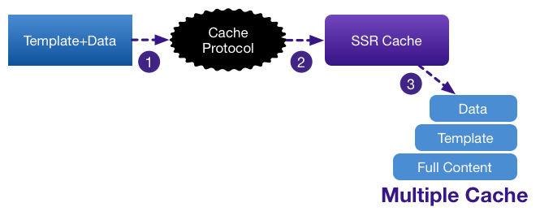
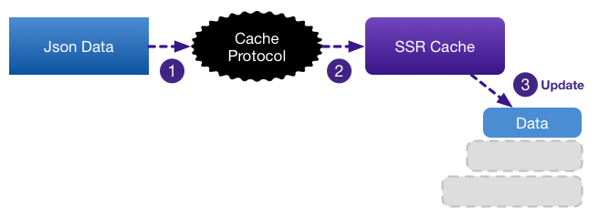
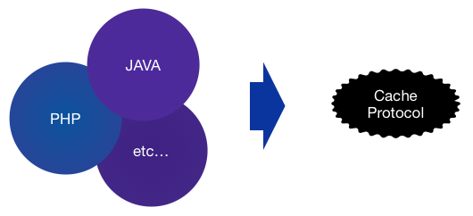
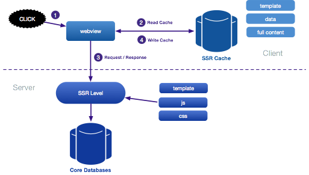
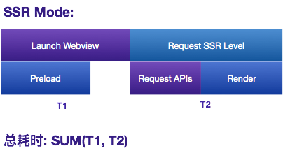

# TmBooster开发文档
TmBooster是一款轻量级的Hybrid框架(以后简称TmB), 该框架的混合开发理念主要用于为安卓以及iOS平台提供跨平台页面渲染加速服务, 其主要输出内容为跨平台页面模板和服务端数据的直出融合, 减少跨平台页面的接口加载以及元素渲染的耗时.

## TmBooster简介与入门
TmB直出框架的核心实现是基于服务端与客户端两端约定的协议, 通过协议服务端在不同的场景下输出不同的内容将触发客户端不同的响应方式从而达到不同的渲染结果, 我们通过下面这个例子作为说明:

    <名称>
        <!--名字的标签-->
        王煜
        <!--名字的标签-结束-->
    </名称>

通过以上的例子我们可以看出, 根据一定的规则我们定义了一个简单的模式(XML)用于描述我的名字是什么, 其中:

    <名称>
    
    </名称>

我们可以把它看做用于一种模板, 用于描述这段数据到底在描述什么, 在模板中所包含的类似于注释的部分:

    <!--名字的标签-->
    
    <!--名字的标签-结束-->

这一段则描述了在这个模板中哪一部分是我(或其他人)的名字, 也就是根据不同的人会发生变化的部分, 我们称之为数据段, 而数据段命名也需要符合一定的规则, 即(数据段名称)和(数据段名称-结束)组合成一对.

至此我们已经了解到直出框架向客户端输出的第一种模式, 即通过输出一个完整的模板+数据的方式通知客户端缓存相应的内容, 客户端在收到这类输出内容的时候会根据约定好的规则将模板和数据拆分缓存, 为我们下一种输出模式做准备.

而第二种输出模式的内容如下:

    {"data":{"名字的标签":"芋头"}}

json格式化后:

    {
      "data": {
        "名字的标签": "芋头"
      }
    }

可以看出, 在第二种输出模式中数据模板(XML)和数据段描述被一段纯json字符串所取代, 从字符串格式化后的结果可以看出, 这是一个单纯用于描述数据段内容的输出, 其作用为通知客户端将数据缓冲中的"王煜"更新为"芋头".

所以综上所述, 通过两种不同的输出方式, 当客户端没有缓存时, 我们通过向客户端输出完整模板+数据的方式帮助客户端获得直出缓存, 如下图所示:

当客户端已缓存了相关直出资源时, 我们只需要向客户端输出需要变化的部分即可完成对客户端直出缓存内容的更新, 如下图所示:

通过协议的方式TmB直出框架获得了操作客户端直出缓存的能力, 而客户端的直出缓存机制拥有很强的语言兼容特性, 只要符合协议的相关规范无论何种语言都可以获得缓存带来的便利特性:

除了简介中提到的使用方法, 缓存协议还有其他许多特性, 这些特性在协议说明章节中有更详细的解释

## TmBooster测试地址
[TmBooster Demo Site](http://172.16.1.132:81/test.php)

## TmBooster的框架结构

## TmBooster的加载时间结构

## TmBooster的协议说明
TmB完全兼容VasSonic相关协议, 客户端可直接使用VasSonic的相关客户端组件, 也可根据以下协议说明自行研发相关解析组件
### 请求头说明
客户端放入header的内容

字段 | 说明 |
--- | --- |
accept-diff | 表示客户端是否支持TmB模式，true为支持，否则不支持 |
If-none-match | 本地缓存的etag，用于和服务端当前直出内容的etag作比较 |
template-tag | 模版唯一标识(哈希值)，服务端用于判断模板是否有变更 |
### 响应头说明
服务端放入header的内容

字段 | 说明 |
--- | --- |
etag | 页面内容的唯一标识(哈希值) |
template-tag | 模版唯一标识(哈希值)，客户端用于缓存当前模板标识 |
template-change | 标记模版是否变更，客户端用于判断模板是否有变更 |
cache-offline | 客户端端使用，根据不同类型进行不同行为 |
### cache-offline字段说明
字段 | 说明 |
--- | --- |
true | 保存到到本地缓存并展示返回内容 |
false | 展示返回内容，无需保存到本地缓存 |
store | 保存到本地缓存，如果已经加载本地缓存，则下次加载，否则展示返回内容 |
http | 字段内容为http表示客户端在特定时间内不要请求TmB提供的内容, 用于TmB服务器需要维护或出现故障时容灾使用 |
### 协议模式说明
字段 | 说明 | 条件 |
--- | --- | --- |
首次加载 | 本地没有缓存，即第一次加载页面 | etag为空值或template_tag为空值 |
完全缓存 | 本地有缓存，且缓存内容跟服务器内容完全一样 | etag一致 |
数据更新 | 本地有缓存，本地模版内容跟服务器模版内容一样，但数据块有变化 | etag不一致 但 template_tag一致 |
模版更新 | 本地有缓存，缓存的模版内容跟服务器的模版内容不一样 | etag不一致 且 template_tag不一致 |
### 服务端输出内容详解
服务器会根据客户端的请求头内容分成两种输出模式, 一种是输出json格式化后的数据, 一种是直接输出直出内容

输出内容 | 说明 | 条件 |
--- | --- | --- |
直出内容 | 直接输出经过服务器直出之后的内容 | 模板发生变化或客户端没有相关缓存 |
json格式数据 | 通过服务端格式化过的数据块数据 | 模板没有发生变化 |
### json格式数据字段说明
字段 | 说明 |
--- | --- |
data | 模板中所有通过注释标记过的数据块内容, 用于客户端比较和保存差异数据 |
template-tag | 当前模版唯一标识(哈希值) |
html-sha1 | 直出内容的整体唯一标识(哈希值) |
diff | VasSonic的ios版本sdk的兼容字段, 用于协助ios清除数据块缓存 |

### json格式数据范例

	array(4) {
	  ["data"]=>
	  array(4) {
	    ["{title}"]=>
	    string(19) "<title>test</title>"
	    ["{auto0}"]=>
	    string(35) "<!--tmbdiff-->123<!--tmbdiff-end-->"
	    ["{auto1}"]=>
	    string(35) "<!--tmbdiff-->123<!--tmbdiff-end-->"
	    ["{auto2}"]=>
	    string(35) "<!--tmbdiff-->123<!--tmbdiff-end-->"
	  }
	  ["template-tag"]=>
	  string(40) "6532234f3d4e1e1eb54efca5fe5a0c558d598b33"
	  ["html-sha1"]=>
	  string(40) "834716cdec4a886624fe1b1c7ef2490be10a7484"
	  ["diff"]=>
	  string(0) ""
	}

## TmBooster模板规范
理论上TmB可支持很多模板类型, 如DSL(领域特定语言), html, XML等, 只要模板符合TmB的模板设计规范, Tmb均可对其进行服务器直出, 我们以html作为规范说明

	<html>
	<head>
	    <title>demo</title>
	</head>
	<body>
	    

	        <!--tmbdiff-data1-->
	        

	        <!--tmbdiff-data1-end-->
	        
	        <!--tmbdiff-data2-->
	        

	        <!--tmbdiff-data2-end-->
	    

	</body>
	</html>

我们通过html注释`<!--tmbdiff-data1-->`和`<!--tmbdiff-data1-end-->`的方式标记数据块的开始和结束, 注释需要符合某些正则规律, 比如这段注释采用`tmbdiff-partName`和`tmbdiff-partName-end`作为命名规范

## TmBooster的响应方式
由于我们对TmB的模板就行了分段注释, 所以对于接入TmB的服务端而言, 直出的分段内容可以根据客户端的反馈信息进行分段响应, 比如最常见的更新响应, 以html为例, 我们可以在html中增加JavaScript代码对客户端的回调内容进行更新响应

	<html>
	<head>
	    <title>demo</title>
	    
	</head>
	<body>
	    

	        <!--tmbdiff-data1-->
	        

	        <!--tmbdiff-data1-end-->
	        
	        <!--tmbdiff-data2-->
	        

	        <!--tmbdiff-data2-end-->
	    

	    
	</body>
	</html>
	
上述的html响应顺序如下图, 紫色为js处理部分, 蓝色为客户端处理部分

理论上TmB可以设计成多种客户端响应方式, 例如js, lua等
